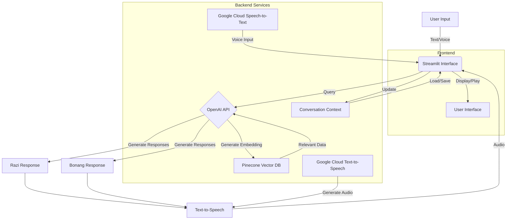

# Halaqah Syumuliyah Islamiyah

Demo platform bahtsul masail virtual Fakhruddin Razi dan Sunan Bonang.

Streamlit + GPT 4.o + Pinecone + Google STTS

## Diagram Alur

## Keterangan

1. Frontend: Streamlit untuk UI dan interaksi pengguna
2. Backend:
   - OpenAI API: Generasi respons dan embedding
   - Pinecone: Vector DB untuk data relevan
   - Google Cloud: Speech-to-Text dan Text-to-Speech
3. Alur:
   - Input user (teks/suara) -> Streamlit -> OpenAI
   - OpenAI query Pinecone untuk konteks
   - OpenAI generate respons Razi dan Bonang
   - Respons dikonversi ke audio
   - Hasil ditampilkan/diputar di UI
4. Konteks percakapan disimpan/dimuat untuk kontinuitas